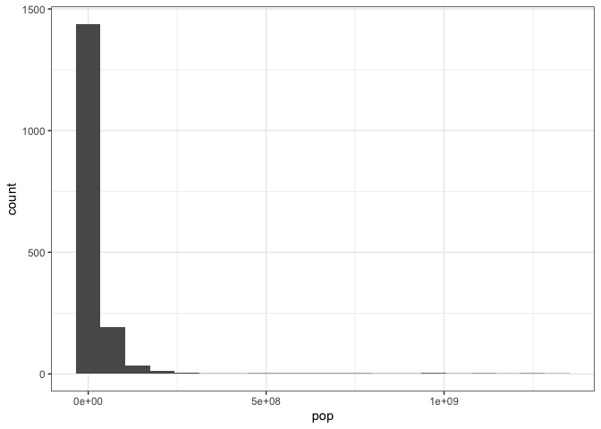

Assignment B1
================
Jia He Zhang

Loading the packages needed for this assignment.

``` r
library(tidyverse)
```

    ## ── Attaching packages ─────────────────────────────────────── tidyverse 1.3.2 ──
    ## ✔ ggplot2 3.3.6      ✔ purrr   0.3.4 
    ## ✔ tibble  3.1.8      ✔ dplyr   1.0.10
    ## ✔ tidyr   1.2.1      ✔ stringr 1.4.1 
    ## ✔ readr   2.1.3      ✔ forcats 0.5.2 
    ## ── Conflicts ────────────────────────────────────────── tidyverse_conflicts() ──
    ## ✖ dplyr::filter() masks stats::filter()
    ## ✖ dplyr::lag()    masks stats::lag()

``` r
library(testthat)
```

    ## 
    ## Attaching package: 'testthat'
    ## 
    ## The following object is masked from 'package:dplyr':
    ## 
    ##     matches
    ## 
    ## The following object is masked from 'package:purrr':
    ## 
    ##     is_null
    ## 
    ## The following objects are masked from 'package:readr':
    ## 
    ##     edition_get, local_edition
    ## 
    ## The following object is masked from 'package:tidyr':
    ## 
    ##     matches

``` r
library(dplyr)
```

## Exercise 1 and 2: Make a Function and Document the Function

I am creating a function that graphs a histogram to explore the
distribution of a column in a dataset.

``` r
#' @title Histogram Distribution Graph
#' 
#' @details Graph the distribution of a column/variable of a dataset with histogram by dividing the x-axis into bins and counting the number of observations in each bin. 
#' 
#' @param data - The dataset you are interested in exploring
#' @param var_x - A numerical variable (or a column) from the dataset that you are interested in visualizing the distribution. 
#' 
#' @return Returns a histogram with the var_x(variable-of-interest) on the x-axis, and count on the y-axis. 

quick_histogram_function <- function(data, var_x) { 
  #Ensure x will be a column from the dataset 
  if (!(deparse(substitute(var_x)) %in% colnames(data))){
    stop("var_x not exist as a column in the data.")
  } 
  #Ensure x is a numerical variable, not a categorical variable. 
  if (!is.numeric(data[[deparse(substitute(var_x))]])) {
    stop("var_x should be a numerical variable.")
  }
  #set the default number of bins to 20.  
  #y-axis of the graph should be named "count"  
  graph<-ggplot(data, aes({{var_x}})) + 
    geom_histogram(bins=20) + 
    labs(y = "count") +
    theme_bw()
  
  return(graph)
}
```

## Exercise 3: Examples

I am going to use the function I created with several different
datasets.

``` r
library(datateachr)
quick_histogram_function(cancer_sample, radius_mean)
```

<!-- -->

In the above example, I am graphing the distribution of radius_mean
variable/column of cancer_sample dataset.

``` r
quick_histogram_function(mtcars, mpg)
```

<!-- -->

In the above example, I am visualizing the distribution of mpg
(miles/gallon) of mtcars dataset.

``` r
library(gapminder)
quick_histogram_function(gapminder, gdpPercap)
```

<!-- -->

In the above example, I am graphing the distribution of GDP per capita
column in the gapminder dataset.

The next example will be one that deliberately shows an error: the var_x
should be a numerical variable not a categorical one.

``` r
quick_histogram_function(gapminder,country)
```

    ## Error in quick_histogram_function(gapminder, country): var_x should be a numerical variable.

The country variable of gapminder dataset is a categorical variable, not
a numerical one, so an error pops out.

## Exercise 4: Test the Function

I am going to test my function with the gapminder dataset.

``` r
test_that("Function working properly", {
  #expect the function to get error if the var_x entered is not a column from the dataset.
  expect_error(quick_histogram_function(gapminder, month), "var_x not exist as a column in the data.")
  #expect the function to get error if the var_x entered is not a numerical variable. 
  expect_error(quick_histogram_function(gapminder, continent), "var_x should be a numerical variable.")
  #testing that printing ggplot object actually works
  p <- quick_histogram_function(gapminder, pop)
  expect_error(print(p), NA)
  })
```

<!-- -->

    ## Test passed 🌈

``` r
test_that("Plot returns ggplot object",{
  p <- quick_histogram_function(gapminder, pop)
  expect_is(p, "ggplot")
})
```

    ## Test passed 🥳

``` r
test_that("Plot uses correct data",{
  p <- quick_histogram_function(gapminder, pop)
  expect_that(gapminder, equals(p$data))
})
```

    ## Test passed 🎊

``` r
test_that("Y-axis is labelled 'count'", {
   p <- quick_histogram_function(gapminder, pop)
  expect_identical(p$labels$y, "count")
})
```

    ## Test passed 🎊
