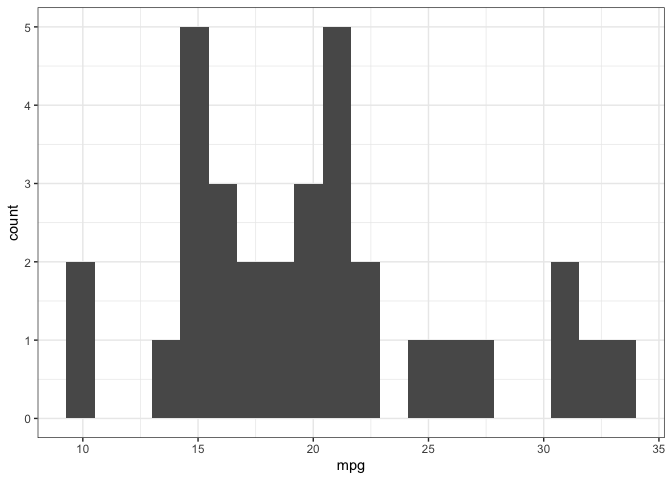
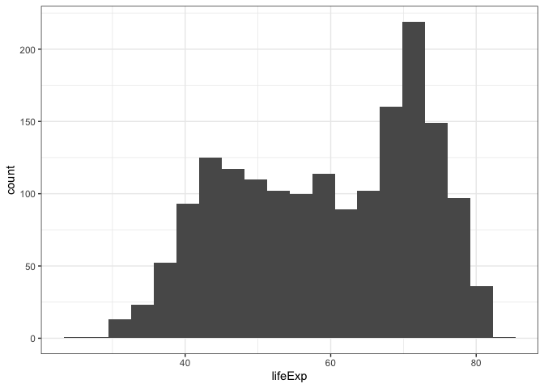

<!-- README.md is generated from README.Rmd. Please edit that file -->

# histogramfunction

<!-- badges: start -->
<!-- badges: end -->

The goal of histogramfunction is to automatically draw a histogram graph
for the distribution of a numerical variable in the dataset. This will
be particularly useful for quickly drawing the distributions if there
are too many numerical variables in the dataset and if you want to see
the distribution of each numerical variable individually.

## Installation

You can install this histogramfunction from
[Github](https://github.com/) with:

``` r
# install.packages("devtools")
devtools::install_github("stat545ubc-2022/assignment-b1-and-b2-JiaheZh/Histogramfunction")
#> Using github PAT from envvar GITHUB_PAT
#> Downloading GitHub repo stat545ubc-2022/assignment-b1-and-b2-JiaheZh@HEAD
#> vctrs   (0.4.2 -> 0.5.1) [CRAN]
#> isoband (0.2.5 -> 0.2.6) [CRAN]
#> ggplot2 (3.3.6 -> 3.4.0) [CRAN]
#> Installing 3 packages: vctrs, isoband, ggplot2
#> Installing packages into '/private/var/folders/df/pphvmxtd0cn8phm_hls0v4440000gn/T/Rtmp8E1mQS/temp_libpath144065c7e7662'
#> (as 'lib' is unspecified)
#> 
#>   There is a binary version available but the source version is later:
#>       binary source needs_compilation
#> vctrs  0.5.0  0.5.1              TRUE
#> 
#> 
#> The downloaded binary packages are in
#>  /var/folders/df/pphvmxtd0cn8phm_hls0v4440000gn/T//RtmpoAe3Lj/downloaded_packages
#> installing the source package 'vctrs'
#> * checking for file ‘/private/var/folders/df/pphvmxtd0cn8phm_hls0v4440000gn/T/RtmpoAe3Lj/remotes154fd2f5f52ac/stat545ubc-2022-assignment-b1-and-b2-JiaheZh-3b5a2e1/Histogramfunction/DESCRIPTION’ ... OK
#> * preparing ‘histogramfunction’:
#> * checking DESCRIPTION meta-information ... OK
#> * checking for LF line-endings in source and make files and shell scripts
#> * checking for empty or unneeded directories
#> * building ‘histogramfunction_0.1.0.tar.gz’
#> Installing package into '/private/var/folders/df/pphvmxtd0cn8phm_hls0v4440000gn/T/Rtmp8E1mQS/temp_libpath144065c7e7662'
#> (as 'lib' is unspecified)
```

## Example 1

The first example uses the mtcars dataset and plots the distribution of
the mpg variable (miles/gallon). A distribution plot should be created
by the end.

``` r
library(histogramfunction)
library(datasets)
quick_histogram_function(mtcars, mpg)
```



## Example 2

The second example uses the gapminder dataset, and plots the
distribution of life expectancy (in years).

``` r
library(gapminder)
quick_histogram_function(gapminder, lifeExp)
```



## Example 3

Please pay attention to the variables you want to plot. The variable has
to be a numerical variable. If you put a categorical varibale, it won’t
work.

The following example purposefully shows an error: var_x has to be a
numerical variable.

``` r
quick_histogram_function(gapminder, country)
#> Error in quick_histogram_function(gapminder, country): var_x should be a numerical variable.
```

The country variable of the gapminder dataset is a categorical variable,
so an error pops out, and the distribution graph can’t be plotted.
